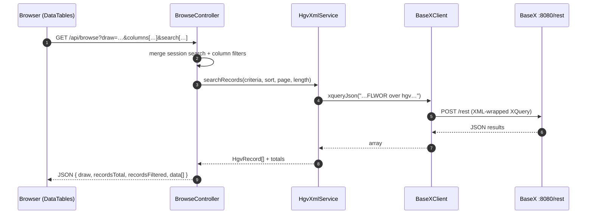

<!-- _class: lead -->

# Aquila

## A guided tour of the HGV web application

<br>

**Heidelberger Gesamtverzeichnis der griechischen Papyrusurkunden Ägyptens**
A catalogue of Greek (and related) papyrus documents from Egypt, paired with
the corresponding edition texts from the Duke Databank (DDB).

<span class="muted">Symfony 5.4 · BaseX · DataTables · Twig</span>

---

## What you will see

1. **What the app does** — a 30-second product pitch
2. **Main user-facing features** — search, browse, datasheet, shortcuts
3. **The architecture** — how a request flows through the stack
4. **The data layer** — three BaseX databases, no SQL
5. **Operations** — how the data gets in, and stays fresh
6. **Map of the code** — where things live in the repo

---

<!-- _class: lead -->

# Part 1 — What it does

---

## In one paragraph

Aquila is a **read-only web frontend** over ≈ 66 000 HGV metadata records and
≈ 70 000 DDB edition texts. It lets papyrologists:

- **Search** the catalogue by 20+ fields (publication, date, place,
  keywords, inventory number, …)
- **Browse** results in a sortable, filterable, column-configurable table
- **Drill in** to a single record with a richly formatted datasheet
- **Jump in directly** via stable URLs (`/hgv/8981a`, `/tm/12345`, `/ddb/...`)
- **Follow cross-references** to papyri.info, Trismegistos, BL-online,
  institutional image hosts, AERE, and the HGV translation corpus

No login, no writes — the runtime never modifies the underlying data.

---

<!-- _class: lead -->

# Part 2 — Main features

---

## Feature 1 — Search form (`/search`)

- Fields grouped by category (publication, dating, place, content,
  inventory, …) — defined in `BrowseController::$FIELD_LIST_SEARCH`
- Per-field **operator** dropdown (`=`, `contains`, `starts with`,
  split-search for keywords, …) — driven by `$OPERATOR_LIST`
- Boolean **AND / OR** across fields
- Special control for `mentionedDates` (without / with / only)
- 5-key **sort** specification with direction (asc/desc)
- Page size 10–500
- Search state lives in the **session**, so it survives navigation
- Side panel: Matomo "popular search keywords"

---

## Feature 2 — Browse (multi) view (`/`)

- A DataTables shell rendered by `BrowseController::multiple()`
- Data fetched server-side from `BrowseController::multipleApi()` (JSON)
- **27 columns** (most hidden by default) — toggle via *colvis* button
- **ColReorder**: drag columns around; the controller maps column-index → key
- Per-column search inputs in `<tfoot>` (debounced 400 ms)
- Buttons: copy / CSV / print / reset
- **State saving** in `localStorage` for 7 days (visibility, order, length)
- Cell renderers turn IDs into links: HGV → `/hgv/{id}`, TM → `/tm/{id}`,
  provenance → Trismegistos place page, etc.

---

## Feature 3 — Single-record datasheet (`/show`, `/hgv/{id}`, …)

Rendered by `templates/browse/_datasheet.html.twig` — a three-zone layout:

| Zone | Content |
|---|---|
| **Header** | Publication, TM link, HGV id, title, place, dating |
| **Metadata table** | Other publications, material, illustrations, BL, commentary, translations (collapsible), keywords, structured provenances, mentioned dates |
| **Dashboard (3 cols)** | DDB text (line-numbered, clipboard, papyri.info link) · picture links (images / IIIF iframes) · pre-rendered HGV translation HTML |

The same template is reused by the *search-result paginator* and by all the
*shortcut* routes — single source of truth for "how a record looks".

---

## Feature 4 — Shortcut URLs

Stable, citeable entry points handled by `ShortcutController`:

```
/hgv/8981a              → lookup by HGV filename (digits + optional letter)
/tm/12345               → lookup by Trismegistos number
/ddb/bgu;1;1            → lookup by ddb-hybrid identifier
/ddb/bgu;1;1/plain      → same record, minimal `plain.html.twig` chrome
```

Each route fetches the full record via `HgvXmlService::getFullRecord()` and
hands it to the datasheet template. Perfect for citations, mail, external
linking from papyri.info, etc.

---

## Feature 5 — Publication list & misc

- **`/publicationList`** — hierarchical publication browser (volume → number)
  backed by `PublicationService` (lazy file cache, 24h TTL, stored in
  `var/cache/publication_index.json`)
- **`/abbreviations`** — table of publication abbreviations
- **`/help/{topic}/{language}`** — bilingual help pages (de/en)
- **`/feedback`** — validated email form (no DB; just SMTP)
- **`/start`** — landing page with intro & links

UI is **bilingual** (German / English) via `translations/messages.{de,en}.yaml`
and `LocaleController`.

---

<!-- _class: lead -->

# Part 3 — Architecture

---

## High-level picture

```
        ┌──────────────────────────────────────────┐
Browser │  Symfony 5.4 + Twig + DataTables         │   public/index.php
  ───▶  │  Controllers · Services · DTO            │
        └────────────┬─────────────────────────────┘
                     │ HTTP — BaseX REST API
                     ▼
        ┌──────────────────────────────────────────┐
        │  BaseX 12.x   (default: :8080/rest)      │
        │  Databases:  hgv · ddb · keywords        │
        └────────────┬─────────────────────────────┘
                     │ on (re)build only
                     ▼
        ┌──────────────────────────────────────────┐
        │  idp.data/   (papyri.info git checkout)  │
        │  data/keywords.csv                       │
        └──────────────────────────────────────────┘
```

**Key property:** the runtime never writes back to BaseX. All rebuilds are
explicit and operator-driven.

---

## Request flow — search → JSON



---

## Layers — who does what

| Layer | Code | Responsibility |
|---|---|---|
| **HTTP / routing** | `config/routes.yaml` · `src/Controller/*` | Parse request, manage session, render Twig or JSON |
| **Service** | `src/Service/HgvXmlService.php` | Build XQuery strings, map rows → DTO |
| **Service** | `src/Service/BaseXClient.php` | Wrap BaseX REST (`xquery`, `xqueryJson`, `xqueryXml`, `getDocument`) |
| **Service** | `KeywordTranslator`, `PublicationService`, `Matomo*` | Cross-cutting concerns (i18n keywords, publication cache, analytics) |
| **DTO** | `src/Dto/HgvRecord.php` | One immutable value object per record |
| **View** | `templates/**.twig` | Server-rendered HTML; partials reused across routes |
| **Client** | `public/js/{browseMulti,datasheet,publication}.js` | DataTables wiring, clipboard, image toggle |

---

## Why BaseX (and not SQL)?

The source data is **already XML** — TEI EpiDoc files maintained upstream by
papyri.info. A relational mapping would mean a lossy ETL on every update.

- Native XPath/XQuery over the same files that are version-controlled in
  `idp.data` (no schema drift, no migrations)
- Full-text + structural queries in one language
- A 2024–25 cleanup **removed Doctrine/MariaDB** entirely — the project now
  has **zero relational state** at runtime
- The only filesystem caches are `var/cache/publication_index.json` and
  pre-rendered translation HTML

Trade-off accepted: BaseX must be running for the app to serve anything.

---

## The three BaseX databases

| Database | Source | Size | Purpose |
|---|---|---|---|
| `hgv` | `idp.data/HGV_meta_EpiDoc/` | ≈ 66 000 docs | Metadata (TEI) — drives search, browse, datasheet |
| `ddb` | `idp.data/DDB_EpiDoc_XML/` | ≈ 70 000 docs | Edition text (TEI) — rendered in the dashboard zone |
| `keywords` | `data/keywords.csv` | ≈ 4 200 entries | de → fr/en/es/it translations of the HGV keyword vocabulary |

All three are built by **one command**:

```bash
bin/console app:basex:create-db          # all
bin/console app:basex:create-db -d hgv   # just one
```

(See `src/Command/BaseXCreateDatabaseCommand.php`.)

---

## Session-based search state

A small but important pattern in `BrowseController`:

- `search`, `sort`, `show` keys live in `RequestStack`'s **session**
- Each action accepts the same params on the query string, which **override**
  the session and are then **persisted back** to it
- `multipleApi()` further merges in DataTables' per-column and global search
- The result: a user can refine in the form, then navigate freely between
  multi-view and single-view without losing their query

`HgvController` (base class) centralises `getParameter` / `getSessionParameter`
/ `setSessionParameter` so all controllers share the same plumbing.

---

<!-- _class: lead -->

# Part 4 — Operations

---

## Bringing the system up

```bash
# 1. PHP deps
composer install

# 2. Config
cp .env .env.local       # set BASEX_URL / BASEX_USER / BASEX_PASSWORD
                         # and IDP_DATA_PATH

# 3. BaseX server
basexhttp -h 8080 -d     # background HTTP/REST on :8080

# 4. Build the three databases (one-off, ~10 min)
bin/console app:basex:create-db

# 5. Dev server
symfony serve            # → http://localhost:8000/
```

Full runbook (upgrades, partial rebuilds, snippet cron, troubleshooting):
[docs/operations.md](operations.md)

---

## Keeping data fresh

| What | How | Cadence |
|---|---|---|
| HGV / DDB XML | `git pull` in `idp.data/`, then rebuild target DB | as upstream releases |
| Keyword translations | edit `data/keywords.csv`, rebuild `keywords` DB | ad-hoc |
| Publication cache | auto-rebuilt on demand, TTL 24h (`var/cache/publication_index.json`) | automatic |
| Translation HTML | `script/updateTextSnippets.sh` (Saxon → `HGV_trans_EpiDoc_HTML/`) | cron |
| Symfony cache | `bin/console cache:clear` after deploys | per deploy |

Rebuilds are **idempotent and explicit** — never triggered by a web request.

---

<!-- _class: lead -->

# Part 5 — Code map

---

## Where to look first

```
src/
├── Kernel.php
├── Command/BaseXCreateDatabaseCommand.php   ← rebuild entry point
├── Controller/
│   ├── HgvController.php          (base: session + params)
│   ├── BrowseController.php       (search · multi · single · api)
│   ├── ShortcutController.php     (/hgv · /tm · /ddb)
│   ├── PublicationController.php  (/publication)
│   ├── DefaultController.php      (start · help · feedback · …)
│   └── LocaleController.php       (de/en switch)
├── Service/
│   ├── BaseXClient.php            ← REST wrapper
│   ├── HgvXmlService.php          ← XQuery builder + row→DTO mapper
│   ├── KeywordTranslator.php      ← EBNF parser over keywords.csv
│   ├── PublicationService.php     ← lazy cached publication tree
│   └── Matomo{,Url,Report}.php    ← analytics
└── Dto/HgvRecord.php              ← one record, ~40 getters

templates/                          ← Twig (base, browse, shortcut, …)
public/js/browseMulti.js            ← DataTables configuration
config/{routes,services,packages/}  ← Symfony wiring
basex/repo/hgv.xqm                  ← reusable XQuery module
docs/operations.md                  ← the runbook
```

---

## Conventions worth knowing

- **Field-key vocabulary is consistent end-to-end** (post 2025 cleanup):
  `publication`, `volume`, `number`, `tm`, `place`, `dating`, `keywords`,
  `notBefore` / `notAfter`, `sortYear`, … — same names in PHP, JS, Twig and
  XQuery variables.
- **DTO over arrays**: every record returned from `HgvXmlService` is an
  `HgvRecord` — templates call getters, not `$record['foo']`.
- **One datasheet template** (`_datasheet.html.twig`) is shared by single,
  shortcut and api views — change it once, it changes everywhere.
- **No magic in the rebuild**: `app:basex:create-db` shells out to the
  `basex` CLI; failures are explicit and reproducible.

---

<!-- _class: lead -->

# Part 6 — Looking ahead

## Aquila as a feeder for our HGV/DDB RAG system

---

## Why this stack is already 80 % of a RAG ingestion pipeline

Our upcoming AI project needs a **retrieval-augmented generation** layer
grounded in HGV + DDB. Aquila is unusually well positioned to seed it:

- **Two complementary corpora, already curated**
  `hgv` = structured metadata (≈ 66 k TEI docs) · `ddb` = edition text
  (≈ 70 k TEI docs) — the exact split a RAG pipeline wants between
  *facts/filters* and *retrievable passages*.
- **One query language for both**: XQuery against BaseX returns clean
  JSON — no scraping, no HTML parsing, no DOM heuristics.
- **Stable, citeable URIs**: `/hgv/{id}`, `/tm/{id}`, `/ddb/{...}` are
  perfect grounding citations to hand back to an LLM (and to a user).
- **Read-only runtime + explicit rebuilds**: no write contention between
  the web app and an ingestion job; embeddings can be re-derived
  deterministically after every `app:basex:create-db`.
- **A controlled multilingual vocabulary** (`keywords` DB, de/fr/en/es/it)
  — ready-made for query expansion and cross-language retrieval.

---

## A concrete pipeline we could build on top

```mermaid
flowchart LR
    A[BaseX<br/>hgv · ddb · keywords] -->|XQuery via<br/>BaseXClient| B[HgvXmlService<br/>→ HgvRecord DTO]
    B --> C[Chunker<br/>per-record + per-field]
    C --> D[Embedder<br/>text-embedding model]
    D --> E[(Vector store)]
    E --> F[RAG retriever]
    F --> G[LLM answer<br/>+ /hgv/{id} citations]
    A -. shortcut URL .-> G
```

**What we get almost for free from Aquila today:**

| RAG need | What Aquila already provides |
|---|---|
| Document loader | `HgvXmlService::getFullRecord()` → `HgvRecord` |
| Metadata for filters | All 20+ search fields, same keys end-to-end |
| Passage text | DDB edition text + pre-rendered translation HTML |
| Stable IDs / citations | `/hgv/`, `/tm/`, `/ddb/` shortcut routes |
| Faceted retrieval | `BrowseController::multipleApi` already does it |
| Vocabulary normalisation | `KeywordTranslator` over `keywords.csv` |

---

## What we would add (and what stays out of Aquila)

**Add (separate ingestion service / Symfony command, e.g. `app:rag:export`):**

- A chunking strategy: 1 chunk per HGV record + 1 chunk per DDB text
  segment, each carrying the full metadata bag as payload
- An embedding step (OpenAI / local model — TBD) and a vector store
  (Qdrant / pgvector / Chroma — TBD)
- An incremental mode keyed on `idp.data` git revisions, so re-ingestion
  is cheap after upstream pulls

**Deliberately keep out of Aquila itself:**

- No embeddings, no vector store, no LLM calls in the web request cycle
- Aquila stays the **canonical, deterministic source of truth**; the RAG
  index is a derived artefact that can be wiped and rebuilt anytime

> Net effect: the AI project inherits a clean, versioned, query-friendly
> corpus on day one — and Aquila remains a plain, fast, auditable web app.

---

<!-- _class: lead -->

# Thanks — questions?

<br>

**Pointers**

- Read me first: [README.md](../README.md)
- Run / fix / rebuild: [docs/operations.md](operations.md)
- Start a request trace at: `src/Controller/BrowseController.php`
- Start a data trace at: `src/Service/HgvXmlService.php`

<span class="muted">Aquila · Symfony 5.4 · BaseX 12 · PHP 8.2</span>
